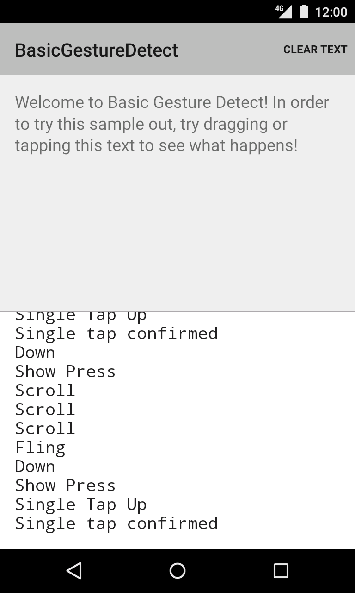

Android BasicGestureDetect Sample
===================================

This sample detects gestures on a view and logs them. In order to try this
sample out, try dragging or tapping the text.

Introduction
------------

In this sample, the gestures are detected using a custom gesture listener that extends
[SimpleOnGestureListener][1] and writes the detected [MotionEvent][2] into the log.

In this example, the steps followed to set up the gesture detector are:
1. Create the GestureListener that includes all your callbacks.
2. Create the GestureDetector ([SimpleOnGestureListener][1]) that will take the listener as an argument.
3. For the view where the gestures will occur, create an [onTouchListener][3]
that sends all motion events to the gesture detector.

[1]: http://developer.android.com/reference/android/view/GestureDetector.SimpleOnGestureListener.html
[2]: http://developer.android.com/reference/android/view/MotionEvent.html
[3]: http://developer.android.com/reference/android/view/View.OnTouchListener.html

Pre-requisites
--------------

- Android SDK 28
- Android Build Tools v28.0.3
- Android Support Repository

Screenshots
-------------

 

Getting Started
---------------

This sample uses the Gradle build system. To build this project, use the
"gradlew build" command or use "Import Project" in Android Studio.

Support
-------

- Stack Overflow: http://stackoverflow.com/questions/tagged/android

If you've found an error in this sample, please file an issue:
https://github.com/android/input

Patches are encouraged, and may be submitted by forking this project and
submitting a pull request through GitHub. Please see CONTRIBUTING.md for more details.
