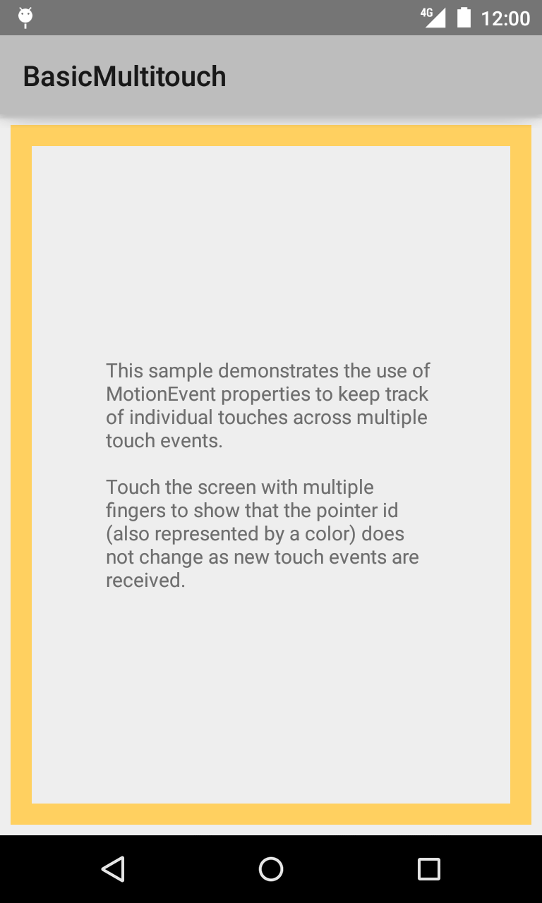
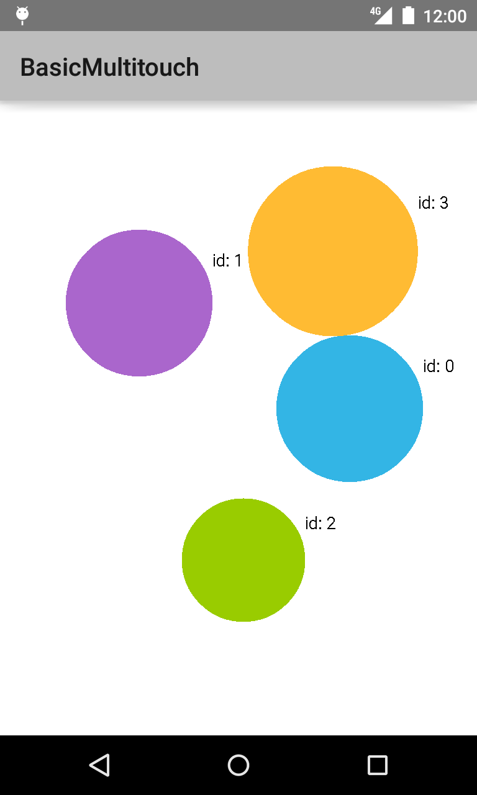

Android BasicMultitouch Sample
===================================

Sample demonstrates the use of [MotionEvent][1] properties to keep track of
individual touches across multiple touch events.

[1]: http://developer.android.com/reference/android/view/MotionEvent.html

Introduction
------------

This is an example of keeping track of individual touches across multiple
[MotionEvent][1]s.

This sample uses a custom View (`TouchDisplayView`) that responds to
touch events and draws a colored circle for each touch point. The view holds
data related to a touch pointer, including its current position, pressure,
and its past touch history.

The View draws graphics based on data associated with each touch event to a
canvas. A large circle indicates the current position of a touch, while smaller
trailing circles represent previous positions for that touch.
The size of the large circle is scaled depending on the pressure of the user's
touch.

[1]: http://developer.android.com/reference/android/view/MotionEvent.html

Pre-requisites
--------------

- Android SDK 28
- Android Build Tools v28.0.3
- Android Support Repository

Screenshots
-------------

  

Getting Started
---------------

This sample uses the Gradle build system. To build this project, use the
"gradlew build" command or use "Import Project" in Android Studio.

Support
-------

- Stack Overflow: http://stackoverflow.com/questions/tagged/android

If you've found an error in this sample, please file an issue:
https://github.com/android/input

Patches are encouraged, and may be submitted by forking this project and
submitting a pull request through GitHub. Please see CONTRIBUTING.md for more details.
